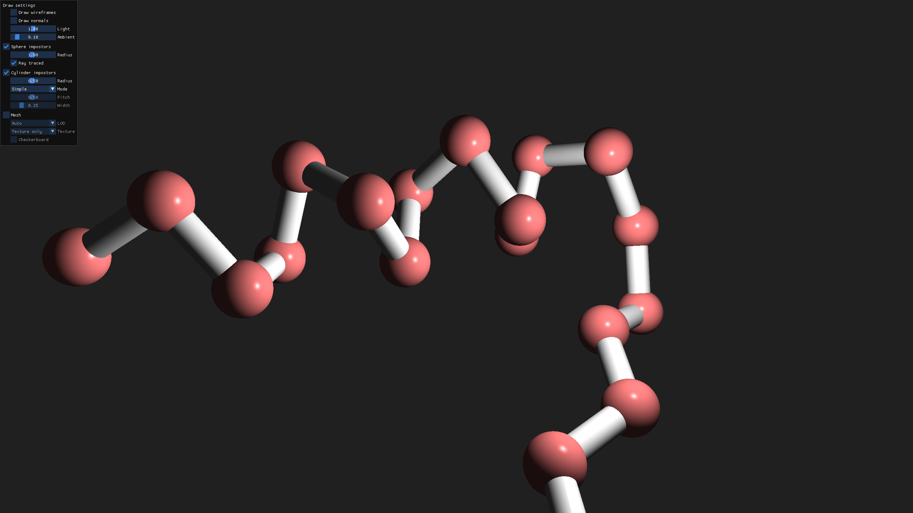
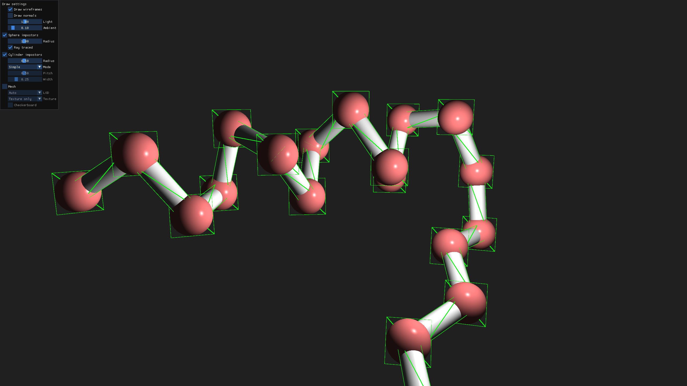
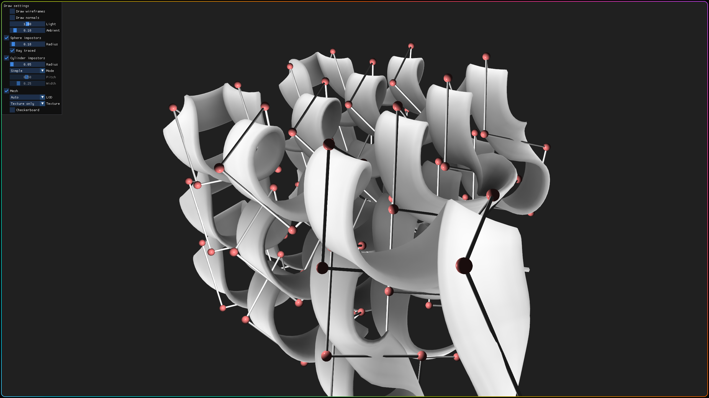
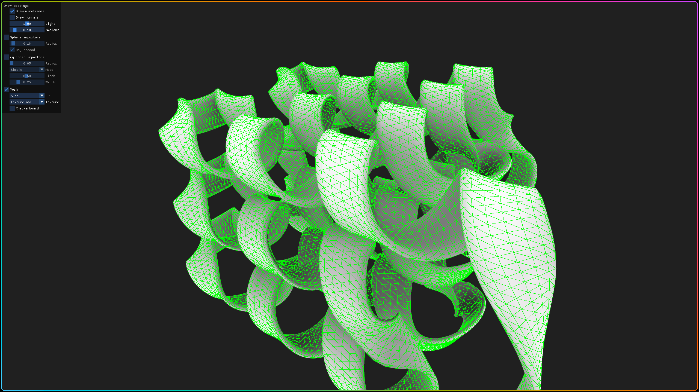
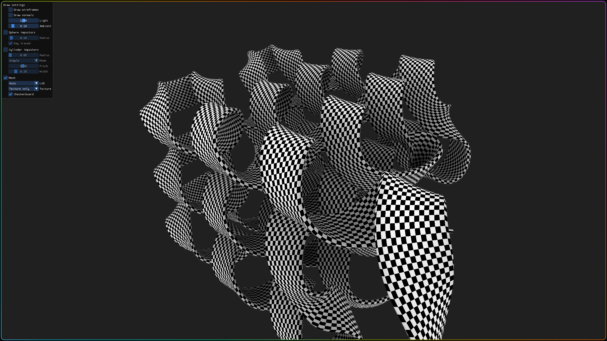

# Molecule rendering using impostors and spline meshes

Developed for University of Amsterdam's [iRASPA](https://iraspa.org/) software.

## Impostors

Impostors can speed up rendering by drawing perfectly rounded spheres and cylinders using very little geometry.
To this end, the vertices of quads are placed in a vertex shader to face the camera, and the fragment shader computes normals, lighting etc. as if there was a sphere / cylinder in its place.

The impostors feature correct Z-coordinates for a 3D appearance even when intersecting, and different cylinder join modes.

|  |  |
| ------------- | ------------- |
|  Result |  Wireframe view |

## Spline meshes

Spline meshes provide a more abstract view of a molecule, in which series of atoms are combined to form tubes, sheets or helices.

They are generated from a set of control points using a custom B-Spline implementation and support LODs with arbitrary resolutions, as well as texture-based baked ambient occlusion.

|  |  |
| ------------- | ------------- |
|  Spline mesh with control points |  Wireframe view |
|  Normals view |  Checkerboard view |

## Build instructions

- Install OpenGL, GLEW, GLFW and GLM
- Run `build_and_run.sh`

The script is just for convenience, the standard CMake procedure should also work on other OSes.
It uses Ninja but works the same with Make.

## References

Bagur, Pranav D., Nithin Shivashankar, and Vijay Natarajan. "Improved quadric surface impostors for large bio-molecular visualization." Proceedings of the Eighth Indian Conference on Computer Vision, Graphics and Image Processing. 2012.

Tarini, Marco, Paolo Cignoni, and Claudio Montani. "Ambient occlusion and edge cueing for enhancing real time molecular visualization." IEEE transactions on visualization and computer graphics 12.5 (2006): 1237-1244.
